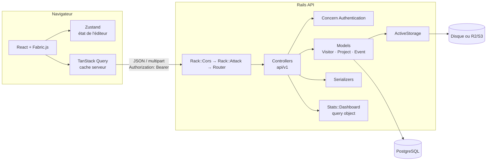
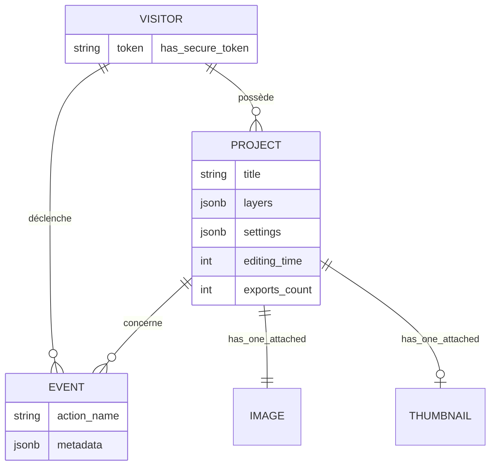

# 🎨 PixelCraft — Éditeur de photos


Éditeur de photos type Instagram : on importe une photo PNG/JPG, on ajoute du texte, des stickers et des filtres, on sauvegarde le projet et on suit l'usage dans un tableau de bord KPI.

Le backend Rails porte les règles métier (propriété des projets, stockage des images, calcul des KPI) ; le frontend React gère l'édition sur le canvas.

---

## ✨ Fonctionnalités

**Éditeur** — upload PNG/JPG (glisser-déposer, vérification de la signature binaire), texte éditable sur le canvas (police, taille, couleur, ombre…), 12 stickers, 11 filtres Instagram + réglages manuels, 4 formats (1:1, 4:5, 16:9, 9:16), annuler/rétablir (50 états), copier/coller.

**Export pour les réseaux sociaux** — chaque format sort aux dimensions attendues par les plateformes, quelle que soit la taille de l'écran : 1080 × 1080 (publication carrée), 1080 × 1350 (portrait), 1080 × 1920 (stories, Reels, TikTok), 1920 × 1080 (YouTube, X, LinkedIn). JPEG ou PNG, nom de fichier explicite (`mon-projet-story-1080x1920.jpg`), et partage direct vers les applis quand l'appareil le permet (Web Share API, surtout sur mobile).

**Projets** — sauvegarde de la photo d'origine, des calques et des réglages ; réouverture à l'identique (format, filtre, calques) ; galerie paginée ; suppression avec confirmation.

**Statistiques** — projets, exports, temps moyen d'édition, usage des outils, exports par destination, parcours Import → Retouche → Export **en visiteurs distincts**, dernières actions.

### Direction visuelle : le labo photo

- **Gris neutre sous la photo** (`#3A3B3E`), comme dans Lightroom ou Capture One : aucune teinte d'interface ne fausse la lecture des couleurs.
- **Un seul accent, l'ambre de la lampe inactinique** (`#F5A524`), réservé à ce qui est actif : outil sélectionné, filtre choisi, export.
- **Les filtres sont une bande de film 35 mm** : chaque vue montre *votre* photo filtrée, avec le numéro de vue imprimé sur le bord.
- **La galerie est une planche contact** : chaque tirage garde le format de sa publication (1:1, 4:5, 16:9, 9:16).
- Une seule famille de caractères (Schibsted Grotesk), chiffres tabulaires pour les statistiques. Sur écran étroit, l'en-tête passe en icônes et les réglages s'ouvrent en panneau superposé.

---

## 🏗️ Architecture



### Le chemin d'une requête : « sauvegarder un projet »

1. **Le navigateur** envoie `POST /api/v1/projects` en multipart : la photo d'origine, une miniature, les calques et réglages en JSON, et le temps passé depuis la dernière sauvegarde.
2. **Middlewares Rack** : `Rack::Cors` vérifie l'origine (liste blanche exacte), `Rack::Attack` limite le débit par IP.
3. **Le router** associe la route à `Api::V1::ProjectsController#create`.
4. **Le concern `Authentication`** lit le jeton `Bearer`, retrouve le `Visitor`, et répond 401 si le jeton est absent ou inconnu.
5. **Le controller** construit le projet *à partir du visiteur* (`current_visitor.projects.new`). C'est ce qui garantit qu'un visiteur ne peut ni lire ni modifier le projet d'un autre : `current_visitor.projects.find(id)` lève une erreur 404 pour un projet étranger.
6. **Le modèle `Project`** valide le titre, le type et le poids des images (PNG/JPG, 10 Mo max) et la taille des calques (1 Mo max). ActiveStorage stocke les fichiers ; les calques et réglages vont dans des colonnes `jsonb`.
7. **La sauvegarde et l'événement `save`** sont écrits dans **la même transaction** : soit les deux réussissent, soit aucun.
8. **`ProjectSerializer`** produit le JSON (URLs ActiveStorage, jamais de base64) ; les erreurs sont centralisées dans `ApplicationController` (`rescue_from` → 400 / 404 / 422).

### Modèle de données



### Où vit chaque responsabilité (backend)

| Fichier | Rôle |
|---|---|
| `app/controllers/concerns/authentication.rb` | Jeton porteur, `current_visitor`, `allow_anonymous` pour les routes publiques |
| `app/controllers/api/v1/projects_controller.rb` | CRUD limité au visiteur, pagination, `POST :export` |
| `app/models/project.rb` | Validations, compteurs atomiques (`update_counters`), `register_export!` |
| `app/models/event.rb` | Actions autorisées ; contexte de validation `:client` qui interdit au navigateur de déclarer un `save` ou un `delete` |
| `app/queries/stats/dashboard.rb` | Calcul des KPI, isolé du HTTP, testé seul |
| `app/serializers/project_serializer.rb` | Contrat JSON : liste légère, détail avec calques |
| `config/initializers/{cors,rack_attack}.rb` | Origines autorisées, limitation de débit |

### Côté frontend

| Fichier | Rôle |
|---|---|
| `components/Editor/Canvas.tsx` | Monte la scène Fabric.js ; la reconstruit au changement de format ou à l'ouverture d'un projet en conservant les calques |
| `lib/layers.ts` | Sérialise / restaure les calques **sans** l'image de fond (historique léger, sauvegarde propre) |
| `lib/scene.ts` | Chargement du fond en mode *cover*, filtres, miniature, vérification des fichiers |
| `lib/api.ts` | Client REST : jeton visiteur, multipart, `assetUrl`, tracking qui ne casse jamais l'éditeur |
| `stores/editorStore.ts` | État de l'éditeur, historique, `openProject` |
| `hooks/useProjects.ts` | Requêtes et mutations TanStack Query (galerie paginée, sauvegarde, stats) |

---

## 💡 Choix techniques

**Photo d'origine + calques séparés.** La photo est stockée telle quelle dans ActiveStorage ; texte et stickers sont des calques JSON. Rouvrir un projet repart donc de l'original, sans perte de qualité ni texte dupliqué. La miniature ne sert qu'à la galerie.

**Visiteur anonyme par jeton plutôt que des comptes.** Le besoin est « chacun ne voit que ses projets », pas « se connecter depuis plusieurs appareils ». `has_secure_token` + `authenticate_with_http_token` couvrent ce besoin sans Devise. Passer à de vrais comptes consisterait à rattacher le `Visitor` à un `User`.

**Les KPI sont calculés côté serveur.** Le compteur d'exports et le temps d'édition sont incrémentés en SQL (`UPDATE … SET x = x + n`), ce qui évite qu'une écriture en écrase une autre. L'entonnoir compte des **visiteurs distincts**, et chaque étape est incluse dans la précédente : un taux de conversion ne peut pas dépasser 100 %.

**Un query object pour les statistiques.** `Stats::Dashboard` ne dépend ni de HTTP ni du controller ; on peut le tester seul et le réutiliser (export CSV, e-mail hebdo…).

**Pas de service layer générique.** La logique métier tient dans les modèles (`register_export!`, `add_editing_time!`) ; on n'extrait un objet que lorsqu'il a une vraie raison d'exister (stats, sérialisation).

**Sécurité.** CORS en liste blanche exacte (`FRONTEND_ORIGINS`), Rack::Attack, limites de taille, `force_ssl` en production, 404 plutôt que 403 sur les ressources étrangères (on ne révèle pas leur existence).

---

## 🚀 Démarrage

```bash
docker compose up --build
```

| Service | URL |
|---|---|
| Frontend | http://localhost:5173 |
| API | http://localhost:3000 |

La base est créée, migrée et remplie de données de démo au premier lancement (`db:prepare`). Si le port 3000 est déjà pris : `BACKEND_PORT=3001 docker compose up`.

### Tests

```bash
# Backend : RSpec (modèles, requêtes, stats, CORS) + RuboCop
docker compose run --rm -e RAILS_ENV=test backend bash -c "unset DATABASE_URL; bundle exec rails db:create db:schema:load && bundle exec rspec"
docker compose run --rm backend bundle exec rubocop

# Frontend : TypeScript + Vitest
cd frontend && npx tsc --noEmit && npm test
```

La CI GitHub Actions (`.github/workflows/ci.yml`) lance les deux suites à chaque push.

### Variables d'environnement

Voir `backend/.env.example` et `frontend/.env.example`. En production : `SECRET_KEY_BASE`, `DATABASE_URL`, `FRONTEND_ORIGINS`, et `ACTIVE_STORAGE_SERVICE=r2` (ou un volume persistant monté sur `/app/storage` : le disque d'un conteneur est effacé à chaque déploiement).

---

## 📡 API

Toutes les routes sauf `POST /visitors` et `GET /stats` exigent `Authorization: Bearer <token>`.

| Méthode | Route | Description |
|---|---|---|
| POST | `/api/v1/visitors` | Crée un visiteur anonyme, renvoie son jeton |
| GET | `/api/v1/projects?page=1` | Projets du visiteur (paginés, sans calques) |
| GET | `/api/v1/projects/:id` | Détail avec calques |
| POST | `/api/v1/projects` | Création (multipart : `image`, `thumbnail`, `layers`, `settings`) |
| PATCH | `/api/v1/projects/:id` | Mise à jour ; `editing_seconds` s'additionne au total |
| DELETE | `/api/v1/projects/:id` | Suppression |
| POST | `/api/v1/projects/:id/export` | Incrémente le compteur d'exports ; `target` et `file_type` alimentent la statistique par destination |
| POST | `/api/v1/events` | Trace une action d'interface (upload, text, sticker, filter, crop, export) |
| GET | `/api/v1/stats` | KPI agrégés |
| GET | `/up` | Healthcheck |

---

## 🔁 v2 — ce qui a changé depuis la première version

| Avant | Après |
|---|---|
| Rouvrir un projet rechargeait la miniature (texte incrusté + basse résolution) puis reposait les calques : texte en double, image dégradée | Photo d'origine dans ActiveStorage, calques séparés |
| Changer de format effaçait textes et stickers | Calques conservés |
| Aucune authentification : tout le monde voyait et supprimait tout | Projets limités au visiteur, 404 sur un projet étranger |
| CORS par regex non ancrée (`*.vercel.app`, contournable) | Liste blanche exacte |
| Entonnoir en événements bruts (taux > 100 % possibles) | Visiteurs distincts, étapes imbriquées |
| Compteur d'exports calculé par le client (bloqué à 1) | Incrément atomique côté serveur |
| Temps d'édition écrasé à chaque sauvegarde | Cumulé |
| Historique : la photo en base64 dans chacun des 50 états | Calques seuls |
| Seeds en échec (action `select` refusée par le modèle), `schema.rb` désynchronisé | Seeds idempotents, schéma régénéré |
| 0 test backend | 39 tests RSpec + RuboCop + CI |

---

## 🚧 Pistes

- Comptes utilisateurs (rattacher `Visitor` à un `User`) pour retrouver ses projets sur plusieurs appareils
- Uploads directs vers R2/S3 (ActiveStorage Direct Uploads) pour ne plus faire transiter les fichiers par Rails
- Variantes d'images générées côté serveur (vips) pour la galerie
- Cache partagé (Redis) pour Rack::Attack si l'API passe à plusieurs instances

## 📄 Licence

MIT
